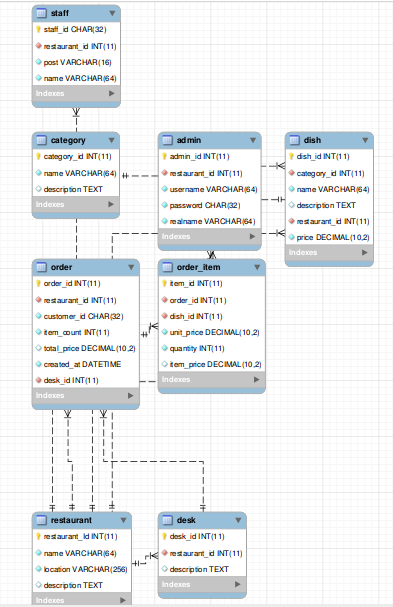

## Database design

### ER图

### DDL
[qr_meals.sql](./qr_meals.sql)

### 7.2.1 用户及权限系统数据库设计

| 用户身份    | 登录方式    | 用户标识 | 相关字段          | 权限                                       |
| ----------- | ----------- | -------- | ----------------- | ------------------------------------------ |
| 顾客        | 微信        | openid   | order.customer_id | 创建订单                                   |
| 厨师/服务员 | 微信        | openid   | staff.staff_id    | 更改菜品状态为“制作中”、"已出菜"、"已上菜" |
| 管理员      | 用户名+密码 | user_id  | admin.admin_id    | 增删桌子、查询订单、增删菜品、增删职员     |

### 7.2.2 订单管理子系统数据库设计

- 涉及order、order_item表等
- 流程：
  1. 创建order，获得order_id
  2. 新建order_item，其order_id由第1步得到
  3. 重复第2步零至多次
  4. 填写第1步获得的记录的item_count和total_price字段
- order_item.item_price属于mysql的generated类型字段，由order_item.unit_price*order_item.quantity计算得到

### 7.2.3 菜品管理子系统数据库设计

- 涉及dish、category表等
- category表记录菜品种类的名称（例如粤菜等）和可选的描述
- dish表的category_id字段关联到category表

### 7.2.4 桌子管理子系统数据库设计

- 涉及desk、restaurant表
- desk表的restaurant_id字段关联到restaurant表

### 7.2.5 人员管理子系统数据库设计

- 涉及staff、admin表
- admin通过username+password的方式登录，staff通过微信登录
- admin有增删staff的权限，admin填写staff的信息（除staff_id外），生成二维码，staff扫码后staff_id（即openid）得以填入

### 7.2.6 第三方数据评审结果

- 设计简明易读，索引、外键约束建立完善
- openid使用char(32)存储，定长字段方便建立索引
- 灵活使用mysql的generated类型字段的功能
- restaurant等数据目前需数据库管理员填入，可考虑添加一个全局管理员身份

